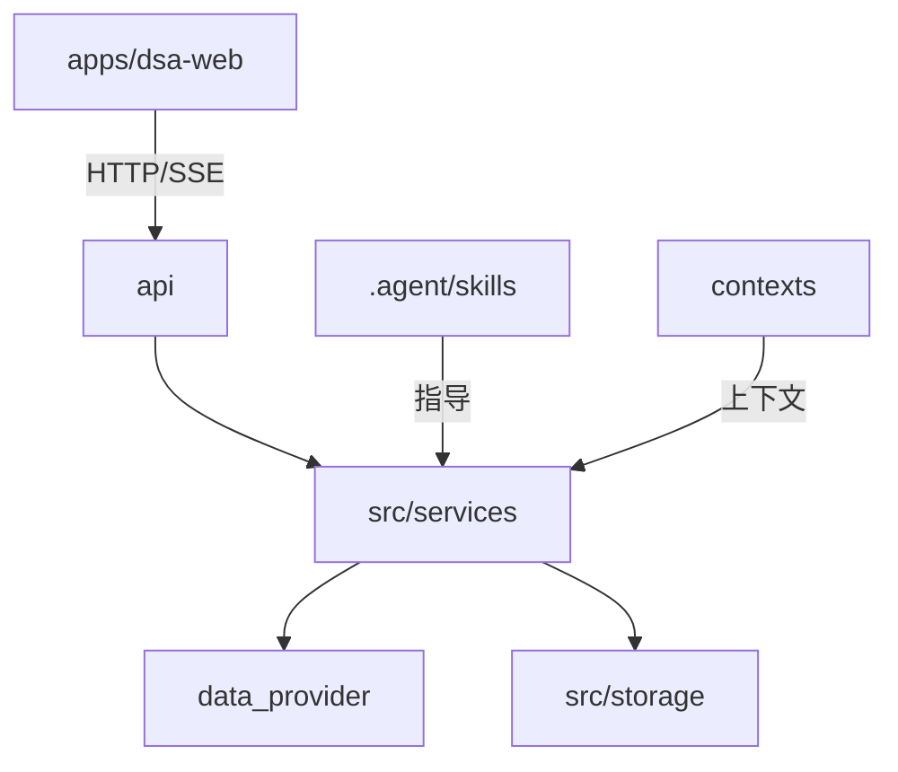

# 项目结构定义 (Project Structure)

> [!NOTE]
> 本文档定义了 `daily_stock_analysis` 项目的目录结构图及各模块职责。

## 1. 整体架构图

## 2. 核心目录说明

### 📂 后端核心 (Python)
- **`src/`**: 业务逻辑核心层。
    - `services/`: AI 对话、股票分析、Agent 管理等核心服务。
    - `storage.py`: 数据库 ORM 模型与持久化管理。
- **`api/`**: 暴露给前端的 RESTFUL 接口定义。
- **`data_provider/`**: 外部行情数据源（如 Tushare, AkShare）的适配与归一化。
- **`bot/`**: 机器人接口集成模块。

### 📂 前端应用 (Web)
- **`apps/dsa-web/`**: 基于 React 和 Vite 的现代化金融终端前端。

### 📂 AI 增强 (Agentic)
- **`.agent/skills/`**: 存放各种 AI 专家技能（如架构卫士、测试专家）。
- **`contexts/`**: Memory Bank 存储地，记录项目上下文。

### 📂 其他工具
- **`scripts/`**: 部署、数据初始化等脚本。
- **`tests/`**: 单元测试与集成测试。
- **`docs/`**: 技术规范与详细文档。

## 3. 开发规范参考
- 异步逻辑优先：所有 I/O 操作必须使用 `async/await`。
- 数据模型统一：行情数据必须适配 `data_provider/realtime_types.py`。
