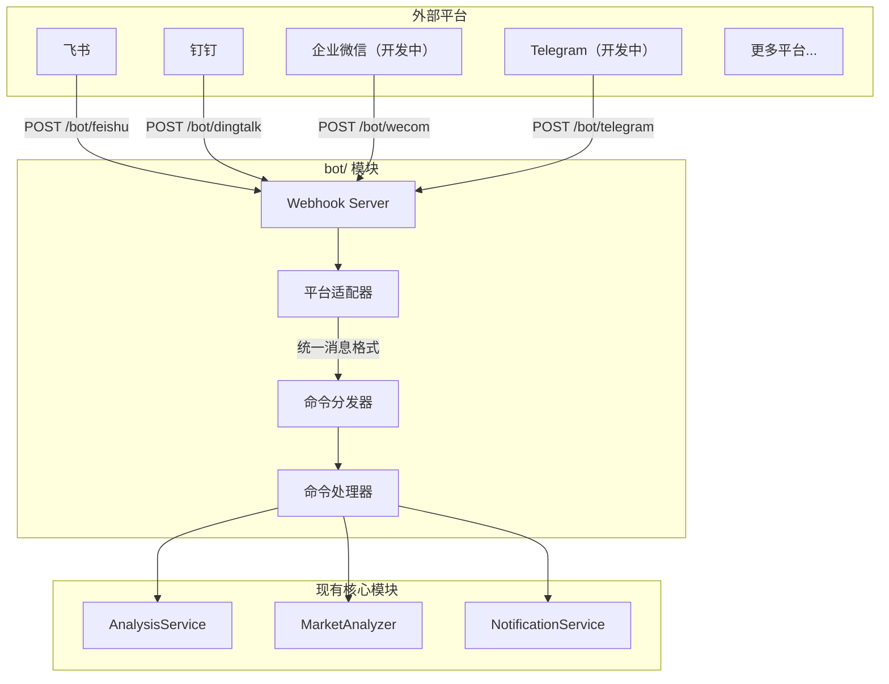

## 一、整体设计




## 二、目录结构

在项目根目录新建 `bot/` 目录：

```
bot/
├── __init__.py             # 模块入口，导出主要类
├── models.py               # 统一的消息/响应模型
├── dispatcher.py           # 命令分发器（核心）
├── commands/               # 命令处理器
│   ├── __init__.py
│   ├── base.py             # 命令抽象基类
│   ├── analyze.py          # /analyze 股票分析
│   ├── market.py           # /market 大盘复盘
│   ├── help.py             # /help 帮助信息
│   └── status.py           # /status 系统状态
└── platforms/              # 平台适配器
    ├── __init__.py
    ├── base.py             # 平台抽象基类
    ├── feishu.py           # 飞书机器人
    ├── dingtalk.py         # 钉钉机器人
    ├── dingtalk_stream.py  # 钉钉机器人Stream
    ├── wecom.py            # 企业微信机器人 （开发中）
    └── telegram.py         # Telegram 机器人 （开发中）
```

## 三、核心抽象设计

### 3.1 统一消息模型 (`bot/models.py`)

```python
@dataclass
class BotMessage:
    """统一的机器人消息模型"""
    platform: str           # 平台标识: feishu/dingtalk/wecom/telegram
    user_id: str            # 发送者 ID
    user_name: str          # 发送者名称
    chat_id: str            # 会话 ID（群聊或私聊）
    chat_type: str          # 会话类型: group/private
    content: str            # 消息文本内容
    raw_data: Dict          # 原始请求数据（平台特定）
    timestamp: datetime     # 消息时间
    mentioned: bool = False # 是否@了机器人

@dataclass
class BotResponse:
    """统一的机器人响应模型"""
    text: str               # 回复文本
    markdown: bool = False  # 是否为 Markdown
    at_user: bool = True    # 是否@发送者
```

### 3.2 平台适配器基类 (`bot/platforms/base.py`)

```python
class BotPlatform(ABC):
    """平台适配器抽象基类"""
    
    @property
    @abstractmethod
    def platform_name(self) -> str:
        """平台标识名称"""
        pass
    
    @abstractmethod
    def verify_request(self, headers: Dict, body: bytes) -> bool:
        """验证请求签名（安全校验）"""
        pass
    
    @abstractmethod
    def parse_message(self, data: Dict) -> Optional[BotMessage]:
        """解析平台消息为统一格式"""
        pass
    
    @abstractmethod
    def format_response(self, response: BotResponse) -> Dict:
        """将统一响应转换为平台格式"""
        pass
```

### 3.3 命令基类 (`bot/commands/base.py`)

```python
class BotCommand(ABC):
    """命令处理器抽象基类"""
    
    @property
    @abstractmethod
    def name(self) -> str:
        """命令名称 (如 'analyze')"""
        pass
    
    @property
    @abstractmethod
    def aliases(self) -> List[str]:
        """命令别名 (如 ['a', '分析'])"""
        pass
    
    @property
    @abstractmethod
    def description(self) -> str:
        """命令描述"""
        pass
    
    @property
    @abstractmethod
    def usage(self) -> str:
        """使用说明"""
        pass
    
    @abstractmethod
    async def execute(self, message: BotMessage, args: List[str]) -> BotResponse:
        """执行命令"""
        pass
```

### 3.4 命令分发器 (`bot/dispatcher.py`)

```python
class CommandDispatcher:
    """命令分发器 - 单例模式"""
    
    def __init__(self):
        self._commands: Dict[str, BotCommand] = {}
        self._aliases: Dict[str, str] = {}
    
    def register(self, command: BotCommand) -> None:
        """注册命令"""
        self._commands[command.name] = command
        for alias in command.aliases:
            self._aliases[alias] = command.name
    
    def dispatch(self, message: BotMessage) -> BotResponse:
        """分发消息到对应命令"""
        # 1. 解析命令和参数
        # 2. 查找命令处理器
        # 3. 执行并返回响应
```

## 四、已支持的命令

| 命令 | 别名 | 说明 | 示例 |

|------|------|------|------|

| /analyze | /a, 分析 | 分析指定股票 | `/analyze 600519` |

| /market | /m, 大盘 | 大盘复盘 | `/market` |

| /batch | /b, 批量 | 批量分析自选股 | `/batch` |

| /help | /h, 帮助 | 显示帮助信息 | `/help` |

| /status | /s, 状态 | 系统状态 | `/status` |

## 五、Webhook 路由

在 [api/v1/router.py](../api/v1/router.py) 中注册路由：

```python
# Webhook 路由
/bot/feishu      # POST - 飞书事件回调
/bot/dingtalk    # POST - 钉钉事件回调
/bot/wecom       # POST - 企业微信事件回调 （开发中）
/bot/telegram    # POST - Telegram 更新回调 （开发中）
```

## 配置

在 [config.py](../config.py) 中新增机器人配置：

```python
# === 机器人配置 ===
bot_enabled: bool = False              # 是否启用机器人
bot_command_prefix: str = "/"          # 命令前缀

# 飞书机器人（事件订阅）
feishu_app_id: str                     # 已有
feishu_app_secret: str                 # 已有
feishu_verification_token: str         # 新增：事件校验 Token
feishu_encrypt_key: str                # 新增：加密密钥

# 钉钉机器人（应用）
dingtalk_app_key: str                  # 新增
dingtalk_app_secret: str               # 新增

# 企业微信机器人（开发中）
wecom_token: str                       # 新增：回调 Token
wecom_encoding_aes_key: str            # 新增：EncodingAESKey

# Telegram 机器人（开发中）
telegram_bot_token: str                # 已有
telegram_webhook_secret: str           # 新增：Webhook 密钥
```

## 扩展说明
### 怎样新增一个通知平台

1. 在 `bot/platforms/` 创建新文件
2. 继承 `BotPlatform` 基类
3. 实现 `verify_request`, `parse_message`, `format_response`
4. 在路由中注册 Webhook 端点

### 怎样新增新增命令

1. 在 `bot/commands/` 创建新文件
2. 继承 `BotCommand` 基类
3. 实现 `execute` 方法
4. 在分发器中注册命令

## 安全相关配置

- 支持命令频率限制（防刷）
- 敏感操作（如批量分析）可设置权限白名单

在 [config.py](../config.py) 中新增机器人安全配置：

```python
    bot_rate_limit_requests: int = 10     # 频率限制：窗口内最大请求数
    bot_rate_limit_window: int = 60       # 频率限制：窗口时间（秒）
    bot_admin_users: List[str] = field(default_factory=list)  # 管理员用户 ID 列表，限制敏感操作
```

